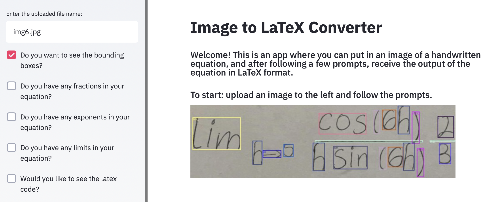

# Handwritten_Equations_to_LaTeX
The end result of this project is an app in Streamlit that takes an image of a handwritten equation, and after prompting the user to follow certain instructions, generates the associated LaTeX syntax for the handwritten equation. This project dealt with custom multi class classification using YOLOv4 in Google Colab. For training, I identified 10,000 calculus equations and trained CNN enabling custom object detection and multilabel classifications for 74 different classes. Each class is a mathematical expression ('x', 'lim', '2', etc.) that are the most commonly found in handwritten Calculus limit equations. Unfortunately, the 74-class custom object detector crashed after running for over 100 hours in CoLab, so I am currently thinking of ways to resolve this issue. However, this project is not my main goal at the moment so it may be a while until a fully functional app is released.

